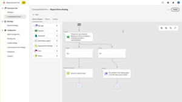

# Tutoriais do [!DNL Marketo Engage]

Navegue pela nossa biblioteca de tutoriais e aproveite ao máximo o [!DNL Marketo Engage]. Esses tutoriais podem ajudar a complementar a [[!DNL Marketo] documentação do produto](https://experienceleague.adobe.com/docs/marketo/using/home.html?lang=pt-BR){target="_blank"} e a melhorar a sua compreensão dos recursos de automação de marketing.

<!-- 

 -->

## Novidades {#whats-new}

* [Práticas recomendadas para implementar o chat ao vivo](https://experienceleague.adobe.com/pt-br/docs/marketo-learn/tutorials/dynamic-chat/live-chat-best-practices)
  _Saiba mais sobre as práticas recomendadas a seguir para implementar o recurso de chat ao vivo no Dynamic Chat._

* [Visão geral dos webinários interativos](https://experienceleague.adobe.com/pt-br/docs/marketo-learn/tutorials/events/interactive-webinars-overview)
  _Saiba tudo sobre Webinários interativos, a plataforma de webinário integrada no Marketo Engage._

* [Migração para o Adobe Identity Management](https://experienceleague.adobe.com/pt-br/docs/marketo-learn/tutorials/fundamentals/migrating-to-adobe-identity-management)
  _Saiba como navegar na migração do Adobe Identity Management para começar a gerenciar o Adobe Marketo Engage junto com outras contas e produtos Adobe de seus usuários em um único local._

## Vídeos mais populares {#most-popular-videos}

<table>
<tr>
<td>

<a href="https://experienceleague.adobe.com/pt-br/docs/marketo-learn/tutorials/programs-and-campaigns/smart-campaigns-101"><strong>Noções básicas sobre campanhas inteligentes</strong></a>

</td>
<td>

<a href="https://experienceleague.adobe.com/pt-br/docs/marketo-learn/tutorials/dynamic-chat/conversational-forms"><strong>Formulários de conversa</strong></a>

</td>
<td>

<a href="https://experienceleague.adobe.com/pt-br/docs/marketo-learn/tutorials/fundamentals/programs-and-campaigns"><strong>Noções básicas sobre programas e campanhas do Marketo</strong></a>

</td>
</tr>
</table>
