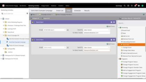
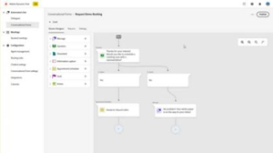

# Tutoriais do [!DNL Marketo Engage]

Navegue pela nossa biblioteca de tutoriais e aproveite ao máximo o [!DNL Marketo Engage]. Esses tutoriais podem ajudar a complementar a [[!DNL Marketo] documentação do produto](https://experienceleague.adobe.com/docs/marketo/using/home.html?lang=pt-BR){target="_blank"} e a melhorar a sua compreensão dos recursos de automação de marketing.

<!-- 

 
-->

## Novidades {#whats-new}

* [Visão geral do Email Designer](/help/main/email-marketing/email-designer-overview.md)
  _Saiba mais sobre os vários recursos disponíveis no Marketo Engage Email Designer._

* [Marketo Engage na Adobe Experience Cloud](/help/main/fundamentals/marketo-engage-aec.md)
  _Saiba como acessar o Marketo Engage pela Adobe Experience Cloud e fazer um rápido tour pela interface._

* [Importação de modelo](/help/main/shorts/template-import.md)
  _Saiba como importar modelos de email existentes do editor clássico para o Designer de email, preservando seus designs e acelerando a criação de modelos..._

## Vídeos mais populares {#most-popular-videos}

<table>
<tr>
<td>

<a href="https://experienceleague.adobe.com/pt-br/docs/marketo-learn/tutorials/programs-and-campaigns/smart-campaigns-101"><strong>Noções básicas sobre campanhas inteligentes</strong></a>

</td>
<td>

<a href="https://experienceleague.adobe.com/pt-br/docs/marketo-learn/tutorials/dynamic-chat/conversational-forms"><strong>Formulários de conversa</strong></a>

</td>
<td>

<a href="https://experienceleague.adobe.com/pt-br/docs/marketo-learn/tutorials/fundamentals/programs-and-campaigns"><strong>Noções básicas sobre programas e campanhas do Marketo</strong></a>

</td>
</tr>
</table>
