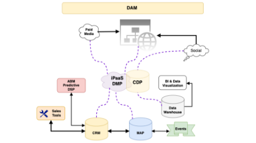

# Crie um diagrama de fluxo de dados visual para entender sua pilha de tecnologia de marketing

Como administrador que assume uma [!DNL Marketo Engage] instância que está ativa há anos, é como uma missão impossível auditar e arrumar a instância com eficiência. Quando o Adobe [!DNL Marketo Champion] (2019), Kelly Jo Horton, interveio em uma instância de longa data, ela enfrentou este desafio por [criação de um diagrama de &quot;Lead e fontes de dados&quot;](https://nation.marketo.com/t5/employee-blogs/understand-your-marketing-technology-and-data-create-this/ba-p/296774){target="_blank"} para se familiarizar com o universo dos dados. Neste tutorial, você aprenderá a criar seu próprio diagrama de fluxo de dados, aproveitando os exemplos compartilhados por Kelly Jo Horton. Vamos conhecer seu ecossistema da MarTech!

## Por que criar um diagrama de arquitetura para sua instância herdada?

1. **Familiarize-se com a pilha de tecnologia de marketing herdada de uma instância ativa.** Todos os gerentes de operações de marketing/gerentes de operações de plataforma são incentivados a fazer esse exercício ao iniciar em uma nova empresa. Esse processo de criação permite que os usuários administradores vejam a imagem completa dos dados e atividades enviados de integrações externas para o [!DNL Marketo Engage] e para solucionar facilmente os erros da API.
2. **Familiarize-se com as principais partes interessadas que gerenciam as integrações externas.** Uma dica que Kelly Jo Horton usa para identificar as partes interessadas rapidamente é fazer referência à lista de usuários da API.
   1. **Navegue até a guia &quot;Integration>LaunchPoint&quot; na seção &quot;Admin&quot;.** Saiba mais sobre como navegar até a guia &quot;LaunchPoint&quot;: [Criar um serviço personalizado para usar com a API REST](https://experienceleague.adobe.com/docs/marketo/using/product-docs/administration/additional-integrations/create-a-custom-service-for-use-with-rest-api.html){target="_blank"}.
   2. Encontre estatísticas de uso de API por usuário de API na guia Integração>Serviços da Web na seção Informações sobre chamada de API. Ao clicar no número da chamada da API, é possível visualizar as chamadas individuais específicas feitas por cada usuário.

## Como fazer este exercício de diagrama de fluxo de dados visuais

### Etapa 1: Diagrama de Estado Atual

Crie um diagrama de &quot;Estado atual&quot;. Veja um exemplo:

{align="center"}

### Etapa 2: diagrama do estado futuro

Crie um diagrama de &quot;Estado futuro&quot; que possa ser usado ao apresentar o roteiro de tecnologia e sistemas para participantes não técnicos. Veja um exemplo:

{align="center"}

### Etapa 3: Versão técnica

Crie uma versão técnica que mostre detalhes como o nome de usuário da API para cada integração, uma breve descrição do tipo de dados que está sendo enviado [!DNL Marketo Engage] ou extraído de [!DNL Marketo Engage]e um diagrama detalhado de todos os fluxos e acionadores de middleware.  Veja um exemplo:

{align="center"}

## O que está por vir?

**Introdução aos exemplos:**
Baixe um dos diagramas de fluxo de dados de amostra para mapear o estado atual de sua pilha de tecnologia de marketing, pessoa e fluxo de dados ou crie um diagrama para seu universo de dados do zero enquanto audita a instância:

<table style="table-layout:fixed">
   <tr>  
      <td style="border: 0;">
      

          <a href="./_assets/downloads/Current_Future_State_Lead_Data_Sources.zip">
            <strong>Estado atual e estado futuro</strong>
         </a>
      

      </td>
      <td style="border: 0;">
      

         <a href="./_assets/downloads/Detailed_Layers_by_Functional_Category_Stacked_Technologies.zip">
         <strong>Camadas detalhadas por categoria funcional </strong>   
         </a>
      

      </td>
      <td style="border: 0;">
         

         <a href="./_assets/downloads/Lead_Data_Source.zip">
           <strong>Fluxo de Cliente Potencial e Fonte de Dados </strong>  
         </a>
         

       </td> 
       <td style="border: 0;">
         

         <a href="./_assets/downloads/Simple_World_Class_Stage_Stack.zip">
          <strong>Diagrama simplificado</strong>  
         </a>
         

        </td>  
   </tr>
   <tr>
    <td style="border: 0;">
         

          
         </a>
      

      </td>
      <td style="border: 0;">
         

         
         

      </td>
       <td style="border: 0;">
         

            
         

      </td>
     <td style="border: 0;">
         

            
         

      </td>
</table>

Estas são algumas ferramentas que você pode usar: draw.io (Google Docs), Adobe XD, Figma, Gliffy (em Confluência)

**E se já houver diagramas de arquitetura?** Novos membros da equipe podem ter diferentes perspectivas. Há valor em ter novas [!DNL Marketo Engage] os administradores fazem esse exercício como parte do processo de integração e o compartilham com outras pessoas.

## Autores

**Kelly Jo Horton**\
Adobe Marketo Champion (2019)
*Parceiro Cliente Sênior na Etumos*

{width="30%"}

**Amy Chiu**
*Gerenciador de marketing de adoção e retenção, Adobe*

{width=30%}
